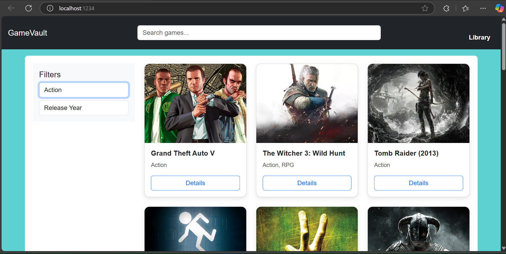
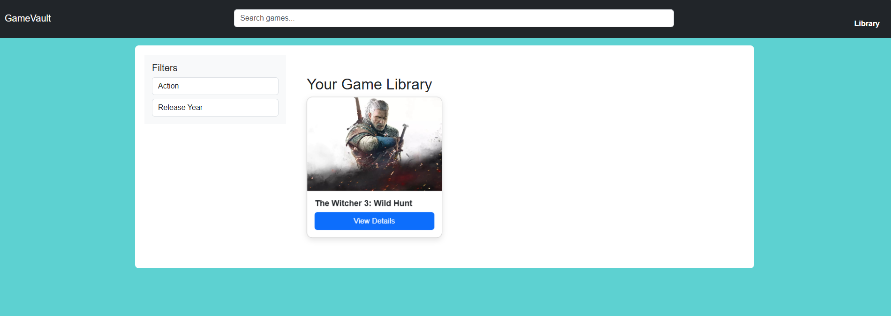

# 🎮 GameVault

GameVault is a React-based web application that lets users browse, search, and explore video games using real-time data fetched from the RAWG Video Games Database API. The app features a sleek UI, dynamic routing, and an interactive library view for saving your favorite games!

---

## 🚀 Features

- 🔍 Search for games in real-time
- 📚 Save and manage your own game library
- 🎮 View detailed game info (ratings, platforms, genres, screenshots, etc.)
- ⚡ Responsive design and smooth UI

---

## 🛠️ Tech Stack

- **Frontend:** React, React Router, CSS
- **API:** [RAWG.io API](https://rawg.io/apidocs)
- **Tooling:** Git, GitHub, VS Code

---

## 📸 Screenshots


### 🏠 Home Page


### 🎮 Game Detail Page


### 📚 Library Page


---

## 🔑 Setup & Installation

1. **Clone the Repo**
```bash
git clone https://github.com/nitinbairwa28/Game-Vault.git
cd Game-Vault
```

2. **Install Dependencies**
```bash
npm install
```

3. **Create a `.env` File**
```bash
REACT_APP_RAWG_API_KEY=your_api_key_here
```

4. **Start the App**
```bash
npm start
```

---

## ⚠️ API Key Info

You need a RAWG API key to fetch game data.

- Get your free key from: https://rawg.io/apidocs
- Add it to a `.env` file like this:

```env
REACT_APP_RAWG_API_KEY=your_key_here
```

---

## 🧠 Folder Structure

```
Game-Vault/
├── index.html
│   
├── src/
│   ├── App.js
│   ├── index.js
│   ├── Library.js
│   └── components/
├── screenshots/
├── .env.example
├── package.json
└── README.md
```
---
